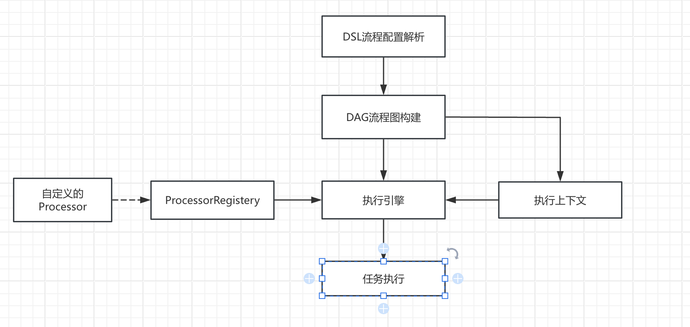

# 自定义任务（动态解析）详细设计

Owner: yy z
Tags: Document

# 架构设计

## 概述图



# 执行流程

- 在执行过程中异常发生时
    - 定义节点状态为Failed，并快速中断相关流程（fail-first)
- 节点成功process后，由流程引擎定义节点状态更新为已完成
- 可以通过SpringBean方式，将节点初始化为Bean，实现ProcessorRegistry自动注入相关bean


## 流程配置解析

- 格式:

```yaml
name: "example" ## 流程名称
version: "1.0" ## 流程版本
dag:
  global-parameters:
  parameter1: "parameter1"
  parameter2: "parameter2"
  nodes:
    - id: file-input
      type: SOURCE
      processor: file-source-function ## 对应Processor
      parameters:
        file-path: "" ## 节点需要的参数, 应该与processor里需要参数对应
    - id: operator-1
      type: PROCESSOR
      processor: oper1
      parameters:
        regex: "####(.?)####"
      deps: [ "file-input" ] ## 依赖于file-input的输出, 这里为ID关联
    - id: operator-2
      type: PROCESSOR
      processor: oper2
      parameters:
        filedMapping:
          name: "description"
      deps: [ "file-input" ]
    - id: sink
      type: SINK
      processor: file-sink
      parameters:
        file-path: ""
      deps: [ "operator-1", "operator-2" ]
```


## DAG实体定义

- 节点定义

```java
class Node {
	String id;
	String name;
	NodeType type;
	String processor;
	Map<String, Object> parameters;
	List<String> deps; // 依赖关系
	NodeStatus status;
}

enum NodeType {
	SOURCE, PROCESSOR, SINK
}

enum NodeStatus {
	PENDING, RUNNING, COMPLETED, FAILED, SKIPPED
}
```

- DAG图定义

```java
class DAGGraph {
	String id;
	/* 对于边的关系描述 */
	Map<String, Node> nodes;
	Map<String, Object> globalParameters;
}
```

- Context流程上下文

```java
class Context {
	Map<String, String> globalParameters;
	Map<String, Object> nodeResults;
}
```

## Processor定义

- 具体的执行逻辑

```java
interface Processor<OUT> {
	/**
	* 在流程处理和初始化参数之前调用的切面方法
	*/
	default void beforeProcess(Node node) {
	}
	/**
	* 用于构建和初始化相关节点的参数信息和资源
	*/
	default void initial(Node node, Context context) {
	}
	/**
	* 具体的流程处理
	*/
	OUT process(Context ctx);
	/**
	* 释放节点相关的资源
	*/
	default void close() {
	}
}
```

- 样例 regex-processor

```java
@Component
class RegexProcessor implements Processor<String, String> {
	
	private String regex;
	
	@Override
	void initial(Node node, Context context) {
		validArgs(context.getGlobalArgs());
		validArgs(node.getParameters());
		this.regex = (String) node.getParameters("regex");
	}
	
	@Override
	@Nullable String process(Context ctx) {
	 	String prev = ctx.getPrevResult();
	 	Matcher matcher = Pattern.compile(regex).matcher(regex);
	 	String result = null;
	 	while (matcher.find()) {
		 	result = matcher.group(1);
	 	}
	 	return result;
	}
}
```

## 流程引擎生成

- 执行引擎主要功能
    - 调度Processor
    - 并发控制
    - 节点的状态管理

```java
class Engine {
	Map<String, Object> execute(Config config) {
		// 校验DAG图表
		// 初始化并发
		// 执行流程处理前置处理
		// 执行初始化参数
		// 具体节点处理及状态管理
		// 完成
	}
}
```